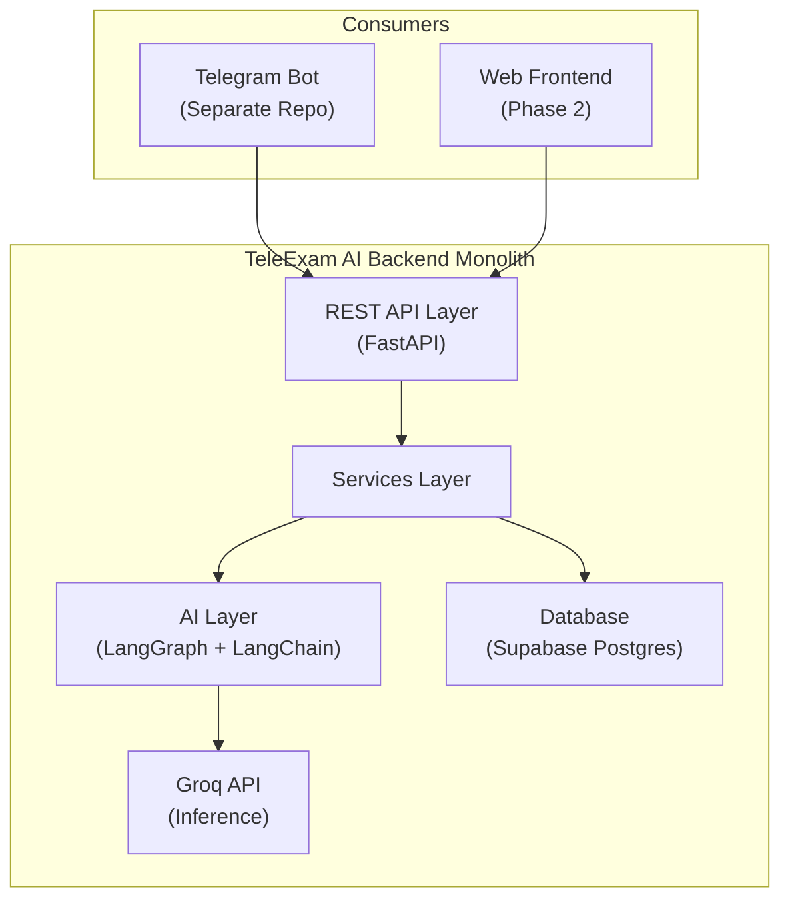
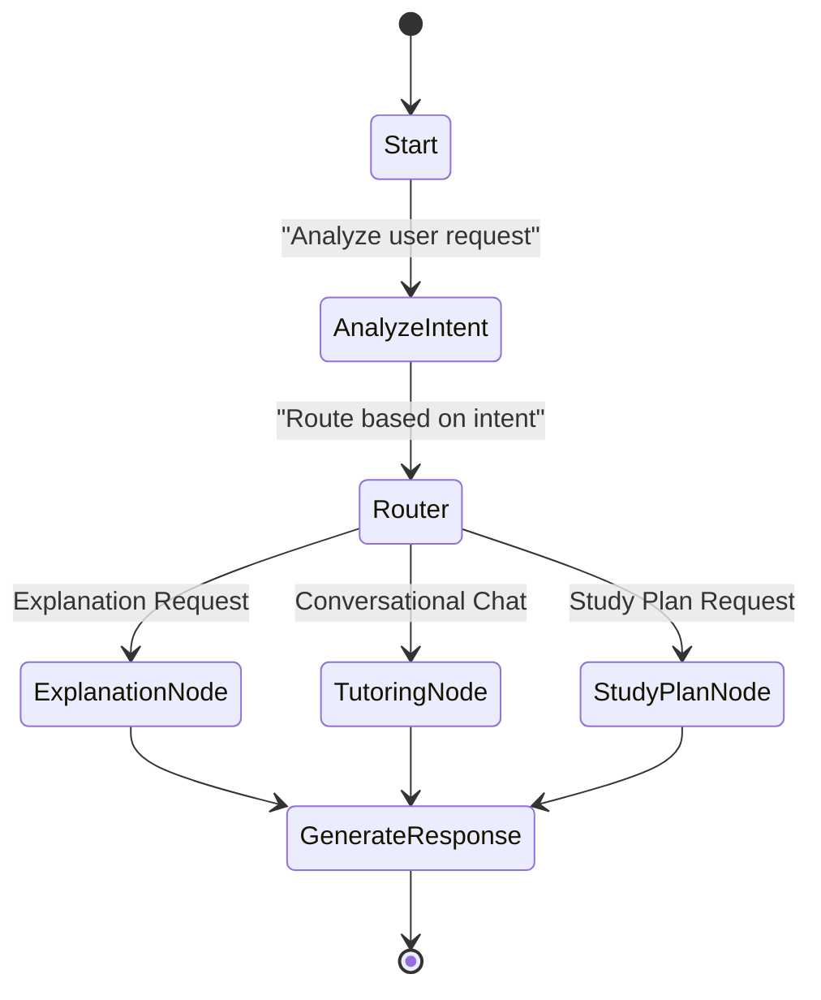
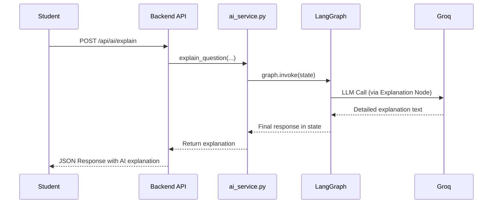

# TeleExam AI - Software Architecture Document

**Document ID:** TEA-SAD-001  
**Version:** 3.5  
**Date:** March 25, 2026  
**Status:** Final – Approved for Development  
**Audience:** Backend & AI Development Team  
**Lead Backend & AI Developer:** DAGMAWI

## 1. Purpose & Scope

TeleExam AI is an intelligent, Telegram-based exam preparation platform. This document outlines the technical architecture of the backend system.

The backend is a **single FastAPI monolith** that provides a clean REST API. This API is primarily consumed by the Telegram bot frontend (maintained in a separate repository) and is designed for future expansion to other clients, such as a web application.

The integrated AI layer uses a **LangGraph, LangChain, and Groq** stack to deliver advanced features, including:
- Detailed, step-by-step explanations for exam questions.
- Multi-turn conversational AI tutoring.
- Personalized study plans (scoped for Phase 2).

## 2. High-Level Architecture

The system is designed around a service-oriented monolithic architecture. A central FastAPI application exposes the API and orchestrates calls to internal business logic services, the AI layer, and the database.



## 3. Folder Structure

The backend repository is organized to separate concerns, promoting maintainability and scalability.

```
teleexam-ai-backend/
├── app/                          # Main application package
│   ├── __init__.py
│   ├── main.py                   # FastAPI app creation + middleware mounting
│   ├── core/                     # Core configurations & security
│   │   ├── __init__.py
│   │   ├── config.py             # Settings using pydantic-settings
│   │   ├── security.py           # Secret validation, rate limit config
│   │   └── middleware.py         # All custom middleware
│   ├── middleware/               # Telegram-specific middleware
│   │   ├── __init__.py
│   │   └── telegram_context.py   # Sets telegram_id + runs SET command for RLS
│   ├── api/                      # All route definitions (thin controllers)
│   │   ├── __init__.py
│   │   ├── deps.py               # Common dependencies (get_current_telegram_id, etc.)
│   │   ├── user.py
│   │   ├── exam.py
│   │   ├── ai.py                 # /api/ai/explain, /api/ai/chat
│   │   ├── session.py
│   │   └── results.py
│   ├── services/                 # Business logic layer
│   │   ├── __init__.py
│   │   ├── user_service.py
│   │   ├── exam_service.py
│   │   ├── session_service.py
│   │   ├── ai_service.py         # LangGraph agent (core AI logic)
│   │   ├── rate_limit_service.py
│   │   └── referral_service.py
│   ├── models/                   # Pydantic models (request/response)
│   │   ├── __init__.py
│   │   ├── user.py
│   │   ├── exam.py
│   │   ├── ai.py
│   │   └── response.py           # Common response schemas
│   ├── db/                       # Database related
│   │   ├── __init__.py
│   │   └── supabase.py           # Supabase client singleton + helpers
│   └── utils/                    # Reusable utilities
│       ├── __init__.py
│       ├── image_generator.py    # Pillow question image generation
│       └── helpers.py
│
├── scripts/                      # One-time scripts
│   ├── __init__.py
│   └── import_exams.py           # JSON → Postgres import (idempotent)
│
├── data/                         # Raw input files (git ignored or example only)
│   └── exams/                    # Put your JSON files here
│
├── tests/                        # Tests
│   ├── __init__.py
│   ├── unit/
│   ├── integration/
│   └── conftest.py
│
├── docs/                         # All documentation
│   ├── arch.md
│   ├── schema.sql
│   ├── api-endpoints.md
│   ├── coding-standards.md
│   └── development-setup.md
│
├── .github/
│   └── workflows/
│       ├── deploy-dev.yml
│       └── deploy-prod.yml
│
├── .env.example
├── .gitignore
├── requirements.txt
├── Dockerfile
├── pyproject.toml                # For black/ruff config
└── README.md
```

## 4. AI Architecture – LangGraph

The core of the AI service is a stateful agent built with LangGraph. The graph defines the flow of logic for handling different AI-related requests.



**Key Components (`app/services/ai_service.py`):**

-   **AnalyzeIntent:** A preliminary node that uses an LLM call to classify the user's intent (e.g., "explain this question," "chat with me") and extract key entities like weak topics.
-   **Router:** A conditional router that directs the graph to the appropriate processing node based on the classified intent.
-   **ExplanationNode:** Generates detailed, educational explanations for specific exam questions.
-   **TutoringNode:** Manages a multi-turn Socratic dialogue, maintaining conversation history to provide contextual tutoring.
-   **StudyPlanNode:** Creates a personalized study plan for the user (Phase 2).

**Agent State:**

The state is the memory of the agent, passed between nodes.

```python
from typing import TypedDict, Annotated
from langchain_core.messages import AnyMessage

# The `add_messages` function is a helper to append new messages to the history.
def add_messages(left: list[AnyMessage], right: list[AnyMessage]) -> list[AnyMessage]:
    return left + right

class AgentState(TypedDict):
    """Defines the state passed between nodes in the LangGraph agent."""
    telegram_id: int
    question: str
    user_answer: str
    # The message history is managed by the `add_messages` function.
    messages: Annotated[list[AnyMessage], add_messages]
    weak_topics: list[str]
    response: str
```

## 5. Data Flow – AI Explanation Request

This sequence diagram illustrates the typical flow for a user requesting an explanation for a question.



## 6. Database Schema Overview

The database schema is designed to support the core entities of an exam platform.

**Main Tables:**
-   `departments`, `courses`, `topics`, `questions`, `exams`, `exam_questions`
-   `users`, `user_sessions`, `results`, `activity_log`

Data integrity and security are enforced directly at the database level using **Row Level Security (RLS)**. All policies are defined in `docs/schema.sql` and rely on the `app.current_telegram_id` context variable set by the middleware.

## 7. Technology Stack

| Layer | Technology | Detail |
|---|---|---|
| Framework | FastAPI + Pydantic v2 | Async, API-first web framework for high performance. |
| AI | LangGraph + LangChain + Groq | Stateful agents for robust and maintainable conversational AI. |
| Database | Supabase Postgres | Managed Postgres with integrated Row Level Security. |
| Authentication | Custom Middleware | Validates a shared secret via the `X-Telegram-Secret` header. |
| Caching | `cachetools` TTLCache | In-process, time-based caching for frequently accessed data. |
| Image Generation | Pillow | On-the-fly generation of images from question text. |
| Deployment | Hugging Face Spaces | Docker-based deployment with CI/CD via GitHub Actions. |

## 8. Authentication & Security

The system employs a simple but effective security model tailored for backend-to-backend integration.

-   **API Key Authentication:** All incoming requests must include a pre-shared secret in the `X-Telegram-Secret` HTTP header. A custom FastAPI middleware is responsible for validating this secret on every protected endpoint.
-   **User Context:** Upon successful authentication, the middleware extracts the user's Telegram ID from the request and sets it in an application-wide context. This context is accessible throughout the request lifecycle.
-   **Row Level Security (RLS):** The application-wide user context is used by Supabase Postgres to enforce RLS. Every database query is automatically filtered to only access data belonging to the current user, ensuring strict data isolation and multi-tenancy.
-   **Rate Limiting:** To prevent abuse, a rate-limiting mechanism is implemented based on the user's `telegram_id`, restricting the number of requests a single user can make in a given time window.

## 9. Phase 1 MVP Scope

-   User onboarding and profile creation.
-   Administrative script for importing exam questions from JSON to Postgres.
-   Core exam flow: starting an exam, submitting answers, and receiving a score.
-   The `/api/ai/explain` endpoint powered by the LangGraph agent.
-   Implementation of RLS for data security and rate limiting for service protection.
-   Deployment to development and production Hugging Face Spaces.

## 10. Future Extensions

-   Implementation of a persistent LangGraph checkpointer in Supabase to maintain conversation state across sessions.
-   Full rollout of the conversational tutoring and personalized study plan features.
-   Development of a web-based frontend for administration and user analytics (Phase 2).
-   Advanced analytics on user performance to automatically detect weak topics.

