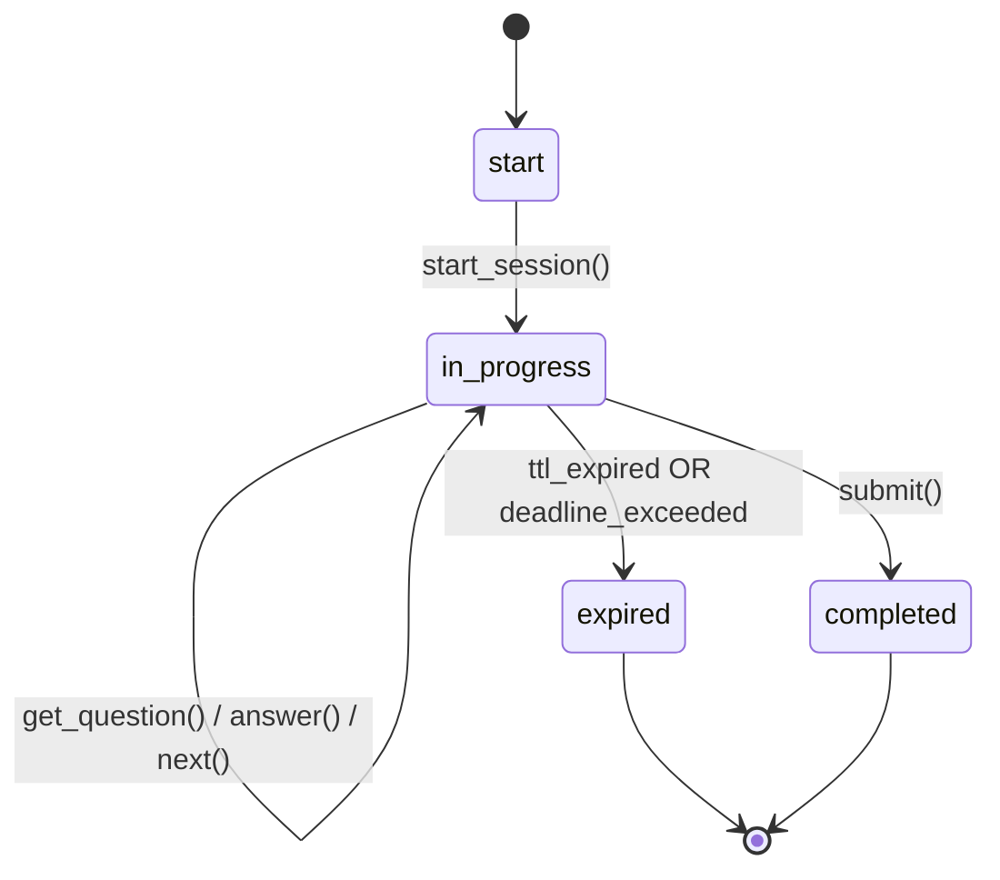
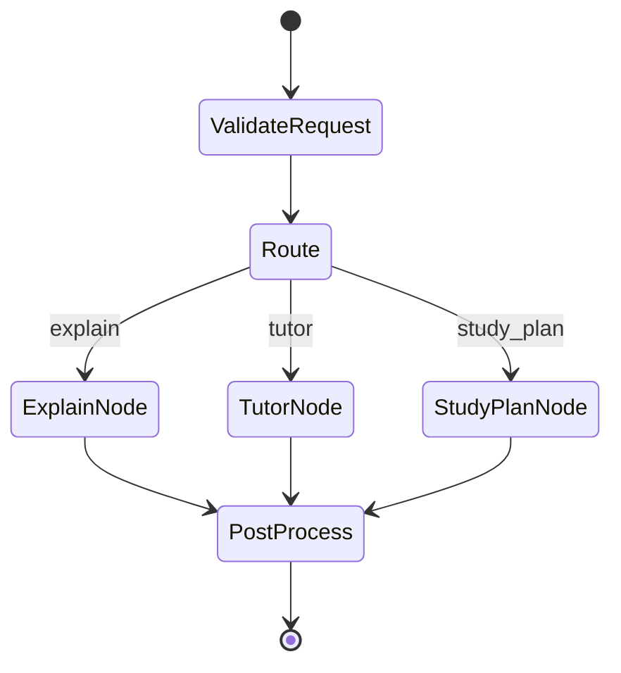
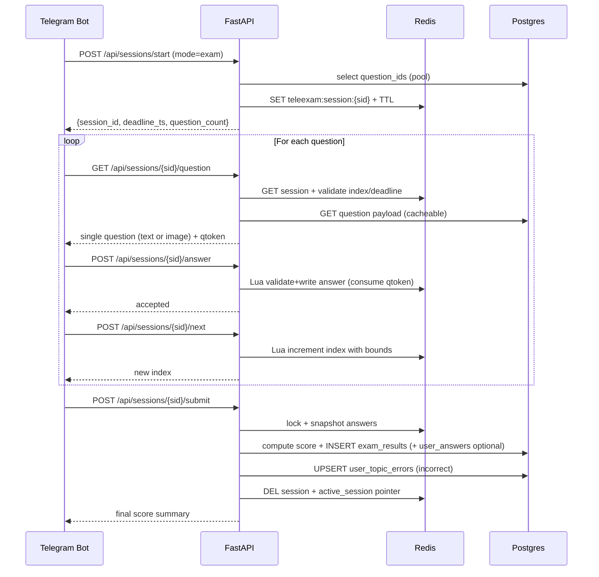
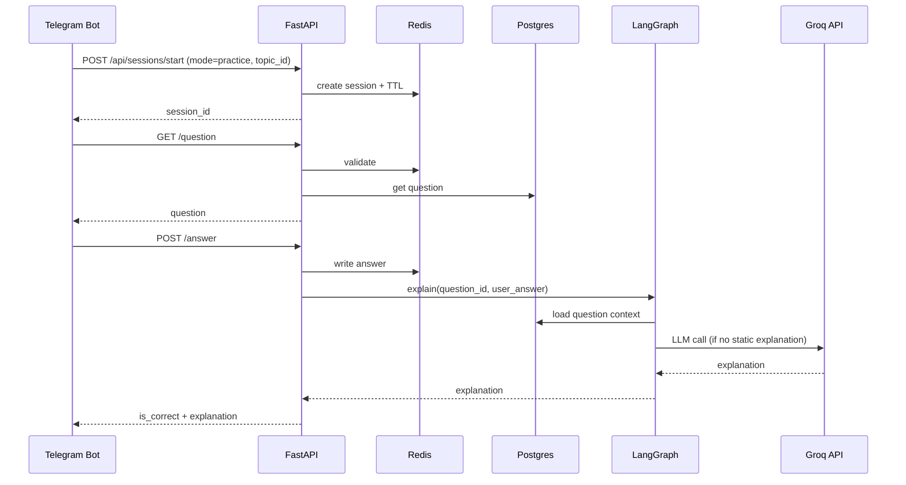

## TeleExam AI (CS‑Ethiopia) — Production System Design (Implementation‑Ready)

**Document ID:** TEA-SAD-001  
**Version:** 4.0 (Production System Design)  
**Date:** March 26, 2026  
**Status:** Implementation-Ready  
**Audience:** Backend, Data, AI, DevOps  
**Primary consumer:** Telegram bot (separate repo) via HTTP REST

---

## 0. Architecture Review — What Was Missing / Weak (and What This Spec Adds)

The previous architecture doc (v3.5) was strong on “monolith + AI stack” but not implementable for production at 1000+ concurrent users. The gaps below are now addressed explicitly in this v4.0 spec.

| Area | What was missing/weak | What this spec defines (implementation-level) |
|---|---|---|
| Redis sessions | No concrete Redis session model/keys/TTL; risk of state in app memory | Session schema, key namespace, TTL strategy, atomic Lua transitions, one-question fetch policy |
| Exam engine | No strict state machine, bounds rules, or sequential enforcement | Formal state machine, mode rules, validation checks, deadline handling, mandatory `qtoken` |
| Anti-scrape | Only general “rate limit” mention; no concrete mechanisms | No bulk API, strict sequential access, mandatory `qtoken`, exam image delivery, rate limiting + behavioral throttling |
| Referral growth | Not specified end-to-end; no idempotency rules | Deep link flow, `invite_code`, `invited_by_user_id`, credit-on-first-quiz logic with safe state |
| Admin control plane | Not defined; no JWT/RBAC; unclear metrics queries | Admin JWT auth, RBAC, endpoints, definitions for DAU/funnel/referrals, index-backed queries |
| Analytics engine | Mentioned future; no durable facts schema | `user_topic_errors` fact table, weak-topics ranking query, write strategy on submit |
| API contracts | Routes existed as names only; no request/response shapes | Full endpoint list with enforced invariants and response payload contracts |
| Failure handling | No Redis/DB failure behavior; no partial recovery guidance | Degraded-mode rules, idempotency keys, submit recovery strategy, consistent error mapping |
| Deployment | Not specified for free-tier constraints | Free-tier sizing guidance, Docker/env config, connection pooling, observability baseline |

## 1. System Overview

TeleExam AI (CS‑Ethiopia) is a Telegram-first, AI-powered exam preparation platform. The backend is a **stateless FastAPI API** that enforces **sequential question access**, **Redis-first sessions**, and **anti-cheating / anti-scraping controls** while persisting only durable records to **PostgreSQL**.

### 1.1 Design principles (non-negotiable)

- **Stateless API nodes**: no in-process user state; all session/concurrency state lives in Redis.
- **Redis-first**:
  - Exam/practice/quiz sessions are stored in Redis and auto-expire via TTL.
  - Rate limiting and anti-scraping primitives use Redis atomic operations/Lua.
- **PostgreSQL for durability**:
  - User profiles, referral relationships, payments/feature gating, question bank, final results, analytics facts.
  - No “live session” persisted to Postgres; sessions are ephemeral in Redis.
- **Telegram-first**:
  - Backend identifies users via `telegram_id`.
  - Supports Telegram deep link referrals `start?ref=<invite_code>`.
- **Secure by default**:
  - Bot-to-backend authentication with shared secret (or signed HMAC) for all `/api/*` routes.
  - Separate admin authentication using JWT.
- **Anti-cheat & anti-scrape**:
  - No bulk question APIs.
  - One question per request, sequential access bound to session.
  - Request rate limits with Redis sliding window.
  - Exam mode uses image-rendered questions + `qtoken` (hard enforced).

### 1.2 Primary user flows

- **Exam mode**: timed, 95–100 questions, no explanations until submission, final score only.
- **Practice mode**: topic-based, immediate explanations after each answer, no time limit.
- **Quiz mode**: 5–10 question batch, fast feedback, used for onboarding & referral rewards.
- **AI**: explanations (post-answer rules) + tutor chat + study plan generator (uses weak-topic analytics).
- **Growth**: referral links; inviter credited when invitee completes first quiz.
- **Admin**: DAU, referral leaderboard, exam funnel/completion, question performance, user management.

### 1.3 Security Enforcement Rules (Hard Constraints)

These rules are **non-negotiable** and **override any optional configuration**. If a feature conflicts with these constraints, the feature must be redesigned.

- **Strict sequential access (all modes)**:
  - Users can only fetch the **current question** where `index == current_index`.
  - No skipping, no arbitrary index access, no `index` query param.
- **Mandatory `qtoken` (single-use, short-lived)**:
  - Every `GET /api/sessions/{session_id}/question` returns a `qtoken` with TTL **60–120 seconds**.
  - Every `POST /api/sessions/{session_id}/answer` must include that `qtoken`.
  - The backend must validate **and delete** the token atomically (single-use) to prevent replay.
- **Single active session per user per mode**:
  - A user may have at most **one active** session per mode (`exam`, `practice`, `quiz`).
  - Enforced via Redis `SETNX` on `teleexam:user:{user_id}:active_session:{mode}` (see Section 3).
  - Starting a new session while one exists must be rejected with `409 Conflict`.
- **No backtracking in exam mode**:
  - No `prev`, no “review”, no index override. Exam is **forward-only**.
- **Image-only question delivery in exam mode**:
  - Exam `GET /question` returns `image_url` (not full text).
  - Image may include watermark with `telegram_id` and `session_id` (recommended).
- **Lazy question loading / no question list exposure**:
  - The backend must **never** return the full `question_ids` list to clients.
  - Session may store minimal IDs internally (Redis only) and/or use deterministic seed-based selection.
- **AI access control**:
  - `/api/ai/explain` is **blocked** for exam sessions unless the session is **completed**.
- **Behavioral anti-bot detection**:
  - Backend tracks timing + request patterns in Redis and applies mitigation:
    - throttle (429), temporary block (403), and admin flagging.

---

## 2. Architecture Diagram (text-based)

```mermaid
flowchart LR
  TG[Telegram Bot (separate repo)] -->|HTTP REST + X-Telegram-Secret| API[FastAPI Backend (Stateless)]
  API --> R[(Redis)]
  API --> PG[(PostgreSQL)]
  API --> AI[AI Orchestrator (LangGraph/LangChain)]
  AI --> GROQ[Groq API (LLM Inference)]

  subgraph Redis
    R1[Sessions: teleexam:session:{session_id}]
    R2[Rate limits: teleexam:rl:*]
    R3[Locks: teleexam:lock:*]
    R4[Question tokens: teleexam:qtoken:*]
    R --> R1
    R --> R2
    R --> R3
    R --> R4
  end
```

---

## 3. Redis Design (Sessions + Concurrency + Rate Limits)

### 3.1 Redis session model (core)

**Session object (stored as Redis Hash or JSON):**

- `session_id` (UUID v4)
- `user_id` (internal UUID/PK from Postgres) and `telegram_id` (int) for validation
- `mode`: `exam | practice | quiz`
- `status`: `start | in_progress | completed | expired` (persisted status in Redis only)
- `question_ids`: list (serialized JSON array of question UUIDs)
- `current_index`: int (0-based)
- `answers`: dict `{question_id: {answer: "A", answered_at: ts, is_correct?: bool}}`
- `start_time`: epoch seconds
- `deadline_ts` (exam/quiz only): epoch seconds (enforced server-side)
- `topic_id` (practice only) or `exam_template_id` (optional)
- `seed` (int) for deterministic per-session randomization
- `attempt_no` (int) optional for re-takes
- `client_fingerprint` (optional): bot build/version or chat_id for debugging, not security

**TTL**:
- Exam: e.g. `TTL = duration_seconds + grace_seconds` (e.g., 2h + 10m).
- Quiz: e.g. 30m.
- Practice: e.g. 24h inactivity TTL.
- **Auto-expire is mandatory**. Any read/write refreshes TTL (rolling TTL) *except* completed sessions.

### 3.2 Redis key structure

All keys are namespaced:

- **Session**: `teleexam:session:{session_id}`
- **Session by user (compat alias / fast lookup)**:
  - `teleexam:exam_session:{user_id}` → `{session_id}` (exam only)
  - `teleexam:practice_session:{user_id}` → `{session_id}` (practice only)
  - `teleexam:quiz_session:{user_id}` → `{session_id}` (quiz only)
- **Session index per user** (single active session per mode): `teleexam:user:{user_id}:active_session:{mode}` → `{session_id}`
- **Session lock** (per session): `teleexam:lock:session:{session_id}` → short TTL
- **Rate limits**:
  - Per user: `teleexam:rl:user:{user_id}:{route}` (sorted set or fixed window buckets)
  - Per telegram_id: `teleexam:rl:tg:{telegram_id}:{route}`
  - Per IP (if relevant): `teleexam:rl:ip:{ip}:{route}`
- **Question token (`qtoken`) (mandatory)**:
  - Issued on every `GET /question`, required on `POST /answer`.
  - Key: `teleexam:qtoken:{session_id}:{current_index}` → random token string
  - TTL: **60–120 seconds** (recommended default 90s)
  - Single-use: validated and deleted atomically at answer acceptance time (Lua).
- **Behavior tracking (anti-bot)**:
  - `teleexam:rt:{session_id}:{current_index}` → question served timestamp (seconds) (TTL aligned with session)
  - `teleexam:behavior:{user_id}` (hash) → counters (fast_answer_count, invalid_qtoken_count, invalid_session_count) + last_seen_ts
  - `teleexam:flag:{user_id}` → `suspected_bot|throttled|blocked` (TTL 1–24h)

### 3.6 Redis memory optimization (required for free-tier)

**Goal**: keep Redis hot keys small and bounded for 1000+ concurrent sessions.

- **Store only IDs in session**:
  - `question_ids` as UUID array (JSON) or Redis list; do not embed full question payload.
- **Bounded answers**:
  - `answers` stores only `{selected_choice, answered_at}` (and `is_correct` only if computed).
  - Do not store LLM explanations in the session.
- **Cache question payload separately** (optional):
  - `teleexam:question_cache:{question_id}` TTL 30–120 min.
- **Prefer Redis Hash fields** over large JSON rewrites:
  - Store `question_ids` once, `current_index` and per-answer fields incrementally.
- **Avoid unbounded ZSET growth** in rate limiting:
  - Always trim items older than window on each request.


### 3.3 Session lifecycle flows (mandatory behavior)

#### Start session

1. Validate user eligibility (feature gating, mode limits, cooldowns).
2. Pick question IDs (Postgres query) and **randomize order** deterministically using `seed`.
3. Create `session_id` and write:
   - `teleexam:session:{session_id}` (hash/json)
   - `teleexam:user:{user_id}:active_session:{mode}` = `session_id` (**SETNX enforced**)
     - If SETNX fails (key exists), reject with `409 Conflict` (single active session per mode).
     - If key exists but referenced session is missing (expired), delete pointer and retry once.
4. Set TTL on session key.
5. Return only `session_id` + metadata (no full question list returned).

#### Fetch question (one at a time)

- Request: `GET /api/sessions/{session_id}/question`
- Server:
  - Validate session exists, belongs to user, status `in_progress`.
  - Validate deadline not exceeded (exam/quiz).
  - Read `current_index`, return only the current question content.
  - Store served time: `teleexam:rt:{session_id}:{current_index} = now`.
  - **Issue `qtoken`**: `teleexam:qtoken:{session_id}:{current_index} = <random>` with TTL 60–120s.
  - **Exam mode**: return `image_url` (and do not return full prompt text).

#### Save answer

- Request: `POST /api/sessions/{session_id}/answer`
- Server:
  - Validate session and that `question_id` == current question.
  - **Validate `qtoken`** for `{session_id, current_index}` and delete it atomically (single-use).
  - Compute response time using `teleexam:rt:{session_id}:{current_index}` and update `teleexam:behavior:{user_id}` counters.
  - Write answer into Redis `answers` dict.
  - For practice/quiz: compute correctness immediately; for exam: optionally defer correctness until submit.
  - Enforce “answer once” policy (configurable):
    - Exam: allow change until final submit *or* lock per question after answering.
    - Quiz: typically lock once answered.
  - Return next-step instruction (stay, show explanation, allow next).

#### Next question

- Request: `POST /api/sessions/{session_id}/next`
- Server:
  - Validate not beyond bounds.
  - Validate current question is answered if mode requires it.
  - Atomically increment `current_index` (use Lua to enforce bounds).

#### Submit session

- Request: `POST /api/sessions/{session_id}/submit`
- Server:
  - Lock the session (Redis lock) to prevent double-submit.
  - Compute score:
    - Fetch correct answers from Postgres for question_ids.
    - Compare against Redis answers.
  - Persist **final results** to Postgres:
    - `exam_results` + analytics facts (incorrect answers by topic).
    - Optionally persist `user_answers` (only if needed for later review/analytics).
  - Delete Redis session + active_session pointer.
  - Return final score summary.

### 3.4 Atomicity & concurrency (required)

Use Redis Lua scripts for:

- **`answer_question`**: validate current question, write answer, optionally mark “answered”.
- **`next_question`**: validate bounds and answered requirement, increment index.
- **`submit_session`**: set `status=completed` if not already, return snapshot for scoring.

**Locking**:

- Use a short-lived lock key `teleexam:lock:session:{session_id}` with `SET key value NX PX 5000`.
- Only used around submit and other idempotency-critical transitions.

### 3.5 Rate limiting (sliding window, Redis)

Enforce at middleware level for `/api/*` and stricter for session/question endpoints.

**Implementation** (recommended):

- Redis sorted set per (subject, route):
  - Add current timestamp score/member.
  - Remove entries older than window.
  - Count size; reject if > limit.

Example policies (tune in config):

- `/api/sessions/*/question`: 30 req/min per user
- `/api/sessions/*/answer`: 60 req/min per user
- `/api/ai/*`: 10 req/min per user (plus daily quotas for free plan)
- Global: 120 req/min per telegram_id

Return `429` with `Retry-After`.

---

## 4. Exam Engine Logic (Modes + State Machine + Rules)

### 4.1 Unified state machine



### 4.2 Mode definitions (implementation constraints)

#### Exam mode

- **Question count**: 95–100 (config per exam template).
- **Timing**: required. Enforce `deadline_ts` server-side.
- **Explanations**: forbidden until submission.
- **Scoring**: final score only (optionally category breakdown).
- **Navigation (hard enforced)**:
  - Strict sequential access: only `current_index` is accessible.
  - Forward-only: `next` allowed; **no `prev`** and no index override.
- **Anti-scrape (hard enforced)**:
  - Exam questions are delivered as **image_url only** (no full text in response).

#### Practice mode

- **Topic-based**: session bound to `topic_id` (or course+topic).
- **Timing**: none.
- **Explanations**: immediate after each answer; AI may be called.
- **Navigation**: sequential; allow “skip” (config) but still one question per request.

#### Quiz mode

- **Question count**: 5–10.
- **Timing**: optional short timer (recommended).
- **Explanations**: immediate after each answer (or after completion, configurable).
- **Onboarding hook**: first completed quiz triggers referral reward credit for inviter.

### 4.3 Navigation validation (hard enforced checks)

These checks are enforced server-side for every session request.

For `GET /api/sessions/{session_id}/question`, `POST /answer`, `POST /next`, `POST /submit`:

- **Strict sequential access**:
  - `GET /question` always returns the question at `current_index`.
  - There is no API to request an arbitrary index.
- **Answer required**:
  - `next` requires the current question to be answered (exam/quiz hard rule; practice optional but recommended).
- **Deadline**:
  - if `now > deadline_ts`, session is treated as expired; only `submit` is allowed.
- **Session ownership**:
  - session `user_id` must match authenticated user derived from `X-Telegram-Id`.
- **Mandatory `qtoken` (single-use)**:
  - `POST /answer` must include the `qtoken` issued by the most recent `GET /question`.
  - Token is deleted after validation (prevents replay).

---

## 5. API Design (Implementation-Level Endpoints)

### 5.1 API authentication model

**Telegram bot → backend**:

- Required header: `X-Telegram-Secret: <shared_secret>` (or `X-Signature` HMAC).
- Required user identity: `X-Telegram-Id: <int>` (set by bot based on Telegram update).

Backend resolves:

- `telegram_id` → `users.id` (user_id) via Postgres.

**Admin**:

- Admin login issues JWT (access token, optional refresh).
- Admin endpoints require `Authorization: Bearer <jwt>` and admin role claim.

### 5.1.1 Error responses (explicit contract)

All errors return JSON:

- `{"error": {"code": "<string>", "message": "<human readable>", "details": {...}}}`

| Status | When returned | Typical codes |
|---|---|---|
| `403 Forbidden` | invalid/expired/missing `qtoken`; banned user; failed shared secret | `invalid_qtoken`, `banned`, `unauthorized_bot` |
| `409 Conflict` | out-of-sync state (wrong question_id), active session already exists, illegal transition | `state_conflict`, `active_session_exists` |
| `429 Too Many Requests` | rate limit or behavioral throttling | `rate_limited`, `throttled` |
| `503 Service Unavailable` | Redis/DB/LLM dependency unavailable for that operation | `redis_unavailable`, `db_unavailable`, `llm_unavailable` |

### 5.2 Public API endpoints (`/api`)

#### User & onboarding

- `POST /api/users/upsert`
  - Input: `telegram_id`, `telegram_username?`, `first_name?`, `last_name?`, `ref_code?`
  - Behavior: create user if not exists; if `ref_code` present and user is new, set `invited_by_user_id`.
- `GET /api/users/me`
  - Output: plan status, quotas, referral stats.

#### Referral

- `GET /api/referrals/my-code`
  - Output: `invite_code` and deep-link string (bot can embed it).
- `GET /api/referrals/status`
  - Output: invite_count, rewards unlocked.

#### Sessions (Exam engine)

- `POST /api/sessions/start`
  - Body:
    - `mode`: `exam|practice|quiz`
    - `course_id?`, `topic_id?`, `exam_template_id?`
    - `question_count?` (only allowed for quiz within bounds)
  - Returns: `session_id`, `mode`, `status`, `ttl_seconds`, `deadline_ts?`, `question_count`
- `GET /api/sessions/{session_id}`
  - Returns: minimal session meta (no question_ids list).
- `GET /api/sessions/{session_id}/question`
  - Returns: **one question only**, always at `current_index` (strict sequential access).
  - Response:
    - `question_id`, `index`, `total`
    - `prompt` (practice/quiz) OR `image_url` (exam)
    - `choice_a..choice_d`
    - `qtoken` (mandatory; TTL 60–120s; single-use)
- `POST /api/sessions/{session_id}/answer`
  - Body: `question_id`, `answer` (A/B/C/D), `qtoken` (mandatory)
  - Returns:
    - `accepted: true`
    - `is_correct?` (practice/quiz)
    - `explanation?` (practice/quiz; AI or static)
- `POST /api/sessions/{session_id}/next`
  - Returns: next index (or next question summary), but **not** question content.
- `POST /api/sessions/{session_id}/submit`
  - Returns: final score, correct_count, wrong_count, optional per-topic breakdown.

#### AI endpoints

- `POST /api/ai/explain`
  - Body: `question_id`, `user_answer`, `mode_context`
  - Enforcement:
    - Exam: only allowed if session completed (or if mode != exam).
    - Free plan: subject to daily quota.
  - Returns: explanation text + key concepts + optional steps.
- `POST /api/ai/tutor`
  - Body: `thread_id?`, `message`, `context?` (course/topic), `weak_topics?`
  - Returns: assistant response, updated `thread_id`.
- `POST /api/ai/study-plan`
  - Body: `course_id`, `time_horizon_days`, `constraints?`
  - Returns: structured study plan (JSON) and narrative.

### 5.3 Pydantic request/response schemas (canonical contracts)

All schemas are Pydantic v2. The Telegram bot should treat these as the stable integration contract.

```python
from __future__ import annotations

from datetime import datetime
from typing import Literal
from uuid import UUID

from pydantic import BaseModel, Field


SessionMode = Literal["exam", "practice", "quiz"]


class UserUpsertRequest(BaseModel):
    telegram_id: int
    telegram_username: str | None = None
    first_name: str | None = None
    last_name: str | None = None
    ref_code: UUID | None = None


class UserResponse(BaseModel):
    user_id: UUID
    telegram_id: int
    invite_code: UUID
    invite_count: int
    is_pro: bool
    plan_expiry: datetime | None = None


class StartSessionRequest(BaseModel):
    mode: SessionMode
    course_id: UUID | None = None
    topic_id: UUID | None = None
    exam_template_id: UUID | None = None
    question_count: int | None = Field(default=None, ge=5, le=10)  # quiz only


class StartSessionResponse(BaseModel):
    session_id: UUID
    mode: SessionMode
    status: Literal["in_progress"]
    question_count: int
    ttl_seconds: int
    deadline_ts: int | None = None


class QuestionPayload(BaseModel):
    question_id: UUID
    index: int
    total: int
    prompt: str | None = None
    image_url: str | None = None  # exam mode: required; practice/quiz: usually null
    choice_a: str
    choice_b: str
    choice_c: str
    choice_d: str
    qtoken: str  # mandatory; short-lived; single-use


class GetQuestionResponse(BaseModel):
    session_id: UUID
    question: QuestionPayload


class SubmitAnswerRequest(BaseModel):
    question_id: UUID
    answer: Literal["A", "B", "C", "D"]
    qtoken: str


class SubmitAnswerResponse(BaseModel):
    accepted: bool = True
    is_correct: bool | None = None  # practice/quiz only
    explanation: str | None = None  # practice/quiz only


class NextResponse(BaseModel):
    session_id: UUID
    index: int


class SubmitSessionResponse(BaseModel):
    session_id: UUID
    mode: SessionMode
    question_count: int
    correct_count: int
    wrong_count: int
    score_percent: float
    submitted_at: datetime
    per_topic_breakdown: list[dict] | None = None
```

**Contract invariants (enforced by backend):**

- `GET /api/sessions/{session_id}/question` returns **exactly one question** and never the full question list.
- `POST /api/sessions/{session_id}/answer` must match the **current question** for the session; otherwise return `409 Conflict`.
- Exam mode never returns `explanation` until after submission.
 - `qtoken` is mandatory and single-use; missing/invalid/expired token returns `403 Forbidden` (or `409` if out-of-sync).

### 5.4 Admin API endpoints (`/admin`)

- `POST /admin/auth/login`
  - Body: `email`, `password`
  - Returns: JWT
- `GET /admin/stats/dau?from=YYYY-MM-DD&to=YYYY-MM-DD`
- `GET /admin/stats/referrals?from=...&to=...`
- `GET /admin/stats/exams?from=...&to=...`
- `GET /admin/stats/questions?from=...&to=...&course_id?=&topic_id?=`
- `GET /admin/users?query=...&limit=...&offset=...`
- `PATCH /admin/users/{user_id}`
  - e.g., set `is_pro`, `plan_expiry`, ban flags.

**Admin responses must be pagination-safe** and index-backed.

---

## 6. Database Design (PostgreSQL) — Full Schema (Core + Analytics + Referral + Admin)

### 6.1 Notes & constraints

- Store **question bank** normalized (courses/topics/questions/choices).
- Store **final exam results** in `exam_results` and analytics facts in `user_topic_errors`.
- Do **not** persist live session state; Redis is the source for in-progress sessions.
- Use UUID primary keys for internal IDs; keep `telegram_id` unique.
- Use `timestamptz` everywhere.

### 6.2 SQL schema (implementation template)

```sql
-- Enable extensions (run once)
CREATE EXTENSION IF NOT EXISTS "uuid-ossp";
CREATE EXTENSION IF NOT EXISTS pgcrypto;

-- =========================
-- USERS + REFERRALS + PLANS
-- =========================
CREATE TABLE IF NOT EXISTS users (
  id uuid PRIMARY KEY DEFAULT gen_random_uuid(),
  telegram_id bigint UNIQUE NOT NULL,
  telegram_username text,
  first_name text,
  last_name text,

  invite_code uuid UNIQUE NOT NULL DEFAULT gen_random_uuid(),
  invited_by_user_id uuid NULL REFERENCES users(id) ON DELETE SET NULL,
  invite_count int NOT NULL DEFAULT 0,
  referral_reward_state jsonb NOT NULL DEFAULT '{}'::jsonb,

  is_pro boolean NOT NULL DEFAULT false,
  plan_expiry timestamptz NULL,

  is_banned boolean NOT NULL DEFAULT false,
  ban_reason text NULL,

  created_at timestamptz NOT NULL DEFAULT now(),
  updated_at timestamptz NOT NULL DEFAULT now()
);

CREATE INDEX IF NOT EXISTS idx_users_invited_by ON users(invited_by_user_id);
CREATE INDEX IF NOT EXISTS idx_users_created_at ON users(created_at);

-- =========================
-- CONTENT: COURSES / TOPICS
-- =========================
CREATE TABLE IF NOT EXISTS courses (
  id uuid PRIMARY KEY DEFAULT gen_random_uuid(),
  code text UNIQUE NOT NULL,
  name text NOT NULL,
  is_active boolean NOT NULL DEFAULT true,
  created_at timestamptz NOT NULL DEFAULT now()
);

CREATE TABLE IF NOT EXISTS topics (
  id uuid PRIMARY KEY DEFAULT gen_random_uuid(),
  course_id uuid NOT NULL REFERENCES courses(id) ON DELETE CASCADE,
  code text NOT NULL,
  name text NOT NULL,
  created_at timestamptz NOT NULL DEFAULT now(),
  UNIQUE(course_id, code)
);

CREATE INDEX IF NOT EXISTS idx_topics_course ON topics(course_id);

-- =========================
-- QUESTIONS
-- =========================
CREATE TYPE question_format AS ENUM ('mcq');

CREATE TABLE IF NOT EXISTS questions (
  id uuid PRIMARY KEY DEFAULT gen_random_uuid(),
  course_id uuid NOT NULL REFERENCES courses(id) ON DELETE CASCADE,
  topic_id uuid NOT NULL REFERENCES topics(id) ON DELETE CASCADE,
  format question_format NOT NULL DEFAULT 'mcq',

  prompt text NOT NULL,
  choice_a text NOT NULL,
  choice_b text NOT NULL,
  choice_c text NOT NULL,
  choice_d text NOT NULL,
  correct_choice char(1) NOT NULL CHECK (correct_choice IN ('A','B','C','D')),

  difficulty smallint NULL CHECK (difficulty BETWEEN 1 AND 5),
  source text NULL,

  explanation_static text NULL, -- optional curated explanation
  is_active boolean NOT NULL DEFAULT true,

  content_hash bytea NOT NULL, -- idempotent ingestion guard
  created_at timestamptz NOT NULL DEFAULT now(),
  updated_at timestamptz NOT NULL DEFAULT now(),
  UNIQUE(content_hash)
);

CREATE INDEX IF NOT EXISTS idx_questions_topic ON questions(topic_id);
CREATE INDEX IF NOT EXISTS idx_questions_course ON questions(course_id);
CREATE INDEX IF NOT EXISTS idx_questions_active ON questions(is_active) WHERE is_active = true;

-- =========================
-- EXAM TEMPLATES (question pools)
-- =========================
CREATE TABLE IF NOT EXISTS exam_templates (
  id uuid PRIMARY KEY DEFAULT gen_random_uuid(),
  course_id uuid NOT NULL REFERENCES courses(id) ON DELETE CASCADE,
  code text NOT NULL,
  name text NOT NULL,
  mode text NOT NULL CHECK (mode IN ('exam','quiz')),
  question_count int NOT NULL,
  duration_seconds int NULL, -- required for exam, optional for quiz
  is_active boolean NOT NULL DEFAULT true,
  created_at timestamptz NOT NULL DEFAULT now(),
  UNIQUE(course_id, code)
);

CREATE TABLE IF NOT EXISTS exam_template_topics (
  exam_template_id uuid NOT NULL REFERENCES exam_templates(id) ON DELETE CASCADE,
  topic_id uuid NOT NULL REFERENCES topics(id) ON DELETE CASCADE,
  weight numeric(6,3) NOT NULL DEFAULT 1.0,
  PRIMARY KEY (exam_template_id, topic_id)
);

CREATE INDEX IF NOT EXISTS idx_exam_template_topics_topic ON exam_template_topics(topic_id);

-- =========================
-- FINAL RESULTS (durable)
-- =========================
CREATE TYPE session_mode AS ENUM ('exam','practice','quiz');

CREATE TABLE IF NOT EXISTS exam_results (
  id uuid PRIMARY KEY DEFAULT gen_random_uuid(),
  user_id uuid NOT NULL REFERENCES users(id) ON DELETE CASCADE,
  course_id uuid NOT NULL REFERENCES courses(id) ON DELETE CASCADE,
  mode session_mode NOT NULL,
  exam_template_id uuid NULL REFERENCES exam_templates(id) ON DELETE SET NULL,
  topic_id uuid NULL REFERENCES topics(id) ON DELETE SET NULL, -- practice

  question_count int NOT NULL,
  correct_count int NOT NULL,
  wrong_count int NOT NULL,
  score_percent numeric(5,2) NOT NULL,

  started_at timestamptz NOT NULL,
  submitted_at timestamptz NOT NULL,
  duration_seconds int NOT NULL,

  metadata jsonb NOT NULL DEFAULT '{}'::jsonb, -- e.g. seed, app_version
  created_at timestamptz NOT NULL DEFAULT now()
);

CREATE INDEX IF NOT EXISTS idx_exam_results_user ON exam_results(user_id, submitted_at DESC);
CREATE INDEX IF NOT EXISTS idx_exam_results_course ON exam_results(course_id, submitted_at DESC);
CREATE INDEX IF NOT EXISTS idx_exam_results_mode ON exam_results(mode, submitted_at DESC);

-- Optional: persist per-question answers for audits/analytics (keep minimal)
CREATE TABLE IF NOT EXISTS user_answers (
  id uuid PRIMARY KEY DEFAULT gen_random_uuid(),
  exam_result_id uuid NOT NULL REFERENCES exam_results(id) ON DELETE CASCADE,
  user_id uuid NOT NULL REFERENCES users(id) ON DELETE CASCADE,
  question_id uuid NOT NULL REFERENCES questions(id) ON DELETE CASCADE,
  topic_id uuid NOT NULL REFERENCES topics(id) ON DELETE CASCADE,

  selected_choice char(1) NOT NULL CHECK (selected_choice IN ('A','B','C','D')),
  is_correct boolean NOT NULL,
  answered_at timestamptz NOT NULL,

  UNIQUE(exam_result_id, question_id)
);

CREATE INDEX IF NOT EXISTS idx_user_answers_user ON user_answers(user_id, answered_at DESC);
CREATE INDEX IF NOT EXISTS idx_user_answers_topic_incorrect ON user_answers(topic_id) WHERE is_correct = false;

-- =========================
-- ANALYTICS FACT TABLES
-- =========================
-- A compact fact table for weak-topic detection (pre-aggregated)
CREATE TABLE IF NOT EXISTS user_topic_errors (
  user_id uuid NOT NULL REFERENCES users(id) ON DELETE CASCADE,
  topic_id uuid NOT NULL REFERENCES topics(id) ON DELETE CASCADE,
  error_count int NOT NULL DEFAULT 0,
  last_error_at timestamptz NOT NULL DEFAULT now(),
  PRIMARY KEY (user_id, topic_id)
);

CREATE INDEX IF NOT EXISTS idx_user_topic_errors_topic ON user_topic_errors(topic_id);

-- Events (for DAU, funnels, abuse signals)
CREATE TABLE IF NOT EXISTS activity_logs (
  id bigserial PRIMARY KEY,
  user_id uuid NULL REFERENCES users(id) ON DELETE SET NULL,
  telegram_id bigint NULL,
  event_name text NOT NULL, -- e.g., session_start, question_view, answer_submit, session_submit, ai_call
  event_ts timestamptz NOT NULL DEFAULT now(),
  properties jsonb NOT NULL DEFAULT '{}'::jsonb
);

CREATE INDEX IF NOT EXISTS idx_activity_logs_ts ON activity_logs(event_ts DESC);
CREATE INDEX IF NOT EXISTS idx_activity_logs_user_ts ON activity_logs(user_id, event_ts DESC);
CREATE INDEX IF NOT EXISTS idx_activity_logs_event_ts ON activity_logs(event_name, event_ts DESC);

-- =========================
-- ADMIN USERS (JWT auth)
-- =========================
CREATE TABLE IF NOT EXISTS admin_users (
  id uuid PRIMARY KEY DEFAULT gen_random_uuid(),
  email text UNIQUE NOT NULL,
  password_hash text NOT NULL,
  role text NOT NULL DEFAULT 'admin',
  is_active boolean NOT NULL DEFAULT true,
  created_at timestamptz NOT NULL DEFAULT now(),
  last_login_at timestamptz NULL
);
```

### 6.3 Weak topics query (ranked list)

Implementation query:

```sql
SELECT
  ute.topic_id,
  t.name AS topic_name,
  ute.error_count,
  ute.last_error_at
FROM user_topic_errors ute
JOIN topics t ON t.id = ute.topic_id
WHERE ute.user_id = $1
ORDER BY ute.error_count DESC, ute.last_error_at DESC
LIMIT 10;
```

---

## 7. Admin System (Control Plane)

### 7.1 Security

- Admin login issues JWT with claims: `sub=admin_user_id`, `role`, `exp`.
- Passwords stored using strong hash (bcrypt/argon2).
- Admin endpoints isolated under `/admin` router with:
  - `AdminAuthMiddleware` or dependency `require_admin()`.
  - Rate limiting stricter than public endpoints.

### 7.2 Metrics definitions (precise)

- **DAU**: distinct users with any `activity_logs` event within day boundary.
- **Exam completion rate**: `session_submit` / `session_start` for mode=exam.
- **Top inviters**: users ordered by `invite_count` (or derived from referrals events) in date window.
- **Question performance**:
  - accuracy = correct / total by question_id (from `user_answers` if enabled, else derive from session submit payload before discard).

### 7.3 Example admin queries

DAU:

```sql
SELECT date_trunc('day', event_ts) AS day, COUNT(DISTINCT user_id) AS dau
FROM activity_logs
WHERE event_ts >= $1 AND event_ts < $2 AND user_id IS NOT NULL
GROUP BY 1
ORDER BY 1;
```

Top inviters:

```sql
SELECT id, telegram_id, telegram_username, invite_count
FROM users
ORDER BY invite_count DESC
LIMIT 10;
```

---

## 8. Referral System (Deep Link → Credit on First Quiz)

### 8.1 Data model

- `users.invite_code` unique UUID.
- `users.invited_by_user_id` set only at user creation.
- `users.invite_count` increments when invitee completes first qualifying quiz.

### 8.2 Flow (precise)

1. Inviter shares deep link: Telegram bot uses `invite_code`:
   - `/start?ref=<invite_code>`
2. New user presses link; bot calls:
   - `POST /api/users/upsert` with `ref_code`
3. Backend:
   - If user exists → ignore `ref_code` (no hijacking).
   - If new user:
     - Look up inviter by `invite_code`.
     - Set `invited_by_user_id`.
     - Log event `referral_joined`.
4. When invitee completes their **first quiz**:
   - On `submit` for mode `quiz`:
     - If `users.referral_reward_state->>'first_quiz_completed'` is not true:
       - Mark it true (transaction).
       - Increment inviter’s `invite_count` by 1.
       - Log event `referral_rewarded`.

### 8.3 Rewards / unlocking thresholds

Implement reward thresholds as config (or DB table):

- 1 invite: unlock 10 extra explanations
- 3 invites: unlock 1 extra exam attempt/day
- 5 invites: unlock tutor mode trial (limited)
- 10 invites: unlock “Pro-lite” (e.g., 7 days) or discount code

Persist state in `users.referral_reward_state` to avoid double-credit.

---

## 9. Pro Plan / Feature Gating

### 9.1 User fields

- `users.is_pro` boolean
- `users.plan_expiry` timestamptz

**Effective pro**:

- `is_pro = true AND (plan_expiry IS NULL OR plan_expiry > now())`

### 9.2 Quotas & gating rules

Enforce in service layer + dependency:

- Free:
  - Limited AI explanations per day (e.g., 10/day).
  - Limited tutor messages/day (e.g., 5/day).
  - Limited exam starts/day (e.g., 1/day).
- Pro:
  - Higher/unlimited quotas.
  - Advanced tutor and study plan features.

### 9.3 Enforcement points

- `start_session()` checks exam start quota.
- `ai_explain()` checks explanation quota and session rules.
- `ai_tutor()` checks tutor quota and pro requirement.
- Use Redis counters with daily TTL for quotas:
  - `teleexam:quota:{user_id}:ai_explain:{YYYYMMDD}`
  - `teleexam:quota:{user_id}:exam_start:{YYYYMMDD}`

---

## 10. Anti-Cheating & Anti-Scraping System

### 10.1 Backend hard rules

- **No bulk question API** exists.
- **One question per request**:
  - `GET /question` returns only the current question.
- **Sequential access only**:
  - Must match `current_index`.
- **Session validation per request**:
  - Session exists in Redis + belongs to user_id.
- **Rate limiting** (Redis sliding window):
  - Enforced on “question view” and “answer submit” routes.
- **Session-bound access**:
  - Question data served only if `question_id` is in session’s `question_ids`.

### 10.2 Additional strategies (recommended)

- **Randomized order per session**:
  - Deterministic shuffle using session `seed` to support audits.
- **Image rendering (exam mode: mandatory)**:
  - Exam mode must return `image_url` (short-lived signed URL) and not full text.
  - Watermark overlay recommended:
    - `telegram_id`, `session_id`, `index`, timestamp (light opacity).
- **Replay attack prevention (mandatory)**:
  - `qtoken` (Section 3/4/5) is single-use and expires in 60–120s.
  - Prevents replays and “bot answering” from a captured payload.
- **Lazy loading / no question list exposure (mandatory)**:
  - Backend never returns the full session `question_ids` list.
  - Acceptable implementation patterns:
    - Store only minimal UUIDs in Redis (`question_ids`) and never expose them, or
    - Store `{exam_template_id, seed}` and derive question IDs server-side deterministically.
- **Behavioral anti-bot detection (mandatory)**:
  - Track per-user and per-session timings in Redis:
    - time from serve→answer, invalid token rate, request bursts.
  - Suspicion rules (example defaults):
    - answer time < 1.0s on ≥3 questions in a session → `suspected_bot`
    - invalid/expired qtoken > 5/min → throttle
  - Mitigations (server-side):
    - throttle: return `429` and increase per-route rate limit strictness
    - temporary block: `403` for 15–60 minutes (`teleexam:flag:{user_id}=blocked`)
    - admin flag: log `activity_logs` event `bot_suspected` with counters
- **Abuse signals**:
  - Log suspicious patterns:
    - Too-fast answering times.
    - Excessive retries/invalid/expired `qtoken`.
    - High question view without answers.
  - Admin can flag/ban users via `users.is_banned`.

---

## 11. AI System Design (LangGraph/LangChain + Groq)

### 11.1 AI capabilities

- **Explain answer**:
  - For practice/quiz immediately after answer.
  - For exam only after submission (hard enforced; see Section 1.3).
- **Tutor mode**:
  - Multi-turn chat; uses thread memory stored in Redis (short-term) and optional Postgres if needed later.
- **Study plan generator**:
  - Inputs weak topics from `user_topic_errors`.
  - Produces a structured plan (JSON) and a narrative.

### 11.2 AI safety & cost controls

- Rate limit AI routes.
- Enforce daily quotas (free vs pro).
- Cache deterministic explanations when possible:
  - Key: `teleexam:ai:explain_cache:{question_id}:{user_answer}:{lang}` with TTL 7 days.
- Always include:
  - course/topic context
  - correct choice (when allowed)
  - user answer
  - explanation style constraints (concise, stepwise, exam-aligned)

### 11.4 AI access control enforcement (hard rules)

- `/api/ai/explain` must validate one of:
  - request is for practice/quiz mode, or
  - request is tied to an **exam result** (`exam_results.id`) / completed session
- If user attempts exam explanation during an active exam session:
  - return `403 Forbidden` with code `exam_explain_blocked`
- The backend must not rely on the bot to enforce this; enforcement is server-side only.

### 11.3 LangGraph node design (implementation-level)



**ValidateRequest**:

- Verify user eligibility (plan/quota).
- Verify mode rules (exam explanation only after submit).
- Load question context from Postgres.

**ExplainNode**:

- If `questions.explanation_static` exists, optionally prefer it for free plan.
- Otherwise call Groq LLM with a strict explanation prompt and output schema.

**TutorNode**:

- Store conversation history in Redis key:
  - `teleexam:ai:thread:{thread_id}` (TTL 24h rolling)

**StudyPlanNode**:

- Query weak topics from Postgres.
- Generate plan; store plan artifact optionally in Postgres `activity_logs` or a dedicated table if needed.

---

## 12. FastAPI Structure (Implementation-Ready)

Target structure:

```
app/
├── main.py
├── core/
│   ├── config.py                 # env, settings
│   ├── logging.py
│   ├── security.py               # shared secret validation + admin JWT helpers
│   └── middleware.py             # auth + rate limit + request id
├── api/
│   ├── deps.py                   # get_current_user, redis, db
│   ├── users.py
│   ├── sessions.py               # start/question/answer/next/submit
│   ├── referrals.py
│   └── ai.py
├── admin/
│   ├── deps.py                   # require_admin
│   ├── auth.py
│   ├── stats.py
│   └── users.py
├── services/
│   ├── user_service.py
│   ├── referral_service.py
│   ├── session_service.py        # Redis sessions + exam engine rules
│   ├── scoring_service.py        # score computation + persistence
│   ├── analytics_service.py      # weak topics aggregation
│   ├── rate_limit_service.py     # redis sliding window + quotas
│   └── ai_service.py             # LangGraph orchestrator
├── schemas/
│   ├── users.py
│   ├── sessions.py
│   ├── ai.py
│   └── admin.py
├── ai/
│   ├── graph.py                  # LangGraph assembly
│   ├── prompts.py
│   └── tools.py
└── db/
    ├── postgres.py               # async engine/session
    ├── redis.py                  # redis client
    └── migrations/               # alembic (recommended)
```

### 12.1 Dependency injection

- `get_db()` → async session (SQLAlchemy async recommended).
- `get_redis()` → `redis.asyncio.Redis`.
- `get_current_user()`:
  - validates shared secret
  - reads `telegram_id` header
  - loads user from Postgres (cached in Redis for a short TTL)

### 12.2 Middleware (required)

- **BotAuthMiddleware**: validate `X-Telegram-Secret` (or HMAC signature).
- **RateLimitMiddleware**: enforce per-route and per-user limits using Redis.
- **RequestIdMiddleware**: attach request_id for tracing.

---

## 13. JSON → Database Ingestion Pipeline (Idempotent + Validated + Logged)

### 13.1 Input format requirements (per question record)

Each JSON record must map to:

- `course_code`, `topic_code`
- `prompt`
- `choices`: `{A,B,C,D}`
- `correct_choice`
- `difficulty?`, `source?`, `explanation_static?`

### 13.2 Validation

- Use Pydantic schema validation (reject invalid).
- Normalize whitespace, ensure choices exist, correct choice in A–D.
- Compute `content_hash` as SHA-256 over normalized content:
  - course_code + topic_code + prompt + A+B+C+D + correct_choice

### 13.3 Idempotent insert strategy

- Insert course/topic if missing (upsert by code).
- Insert question with `UNIQUE(content_hash)`:
  - `INSERT ... ON CONFLICT (content_hash) DO NOTHING`
- Log failed records to a file + `activity_logs` event `ingest_failed` with reason.

### 13.4 Operational logging

For each ingest run:

- total records
- inserted count
- skipped duplicates
- failed count with error categories

---

## 14. Performance & Scalability (1000+ concurrent users on free-tier)

### 14.1 Core strategies

- **Async I/O everywhere** (FastAPI async endpoints, async Postgres, async Redis).
- **Redis as hot path**:
  - session reads/writes
  - rate limits / quotas
  - locks/qtokens
- **Minimal DB writes**:
  - Write on session submit only (results + analytics facts).
  - Append-only `activity_logs` can be sampled or batched if needed.
- **Caching**:
  - Cache user lookup by telegram_id:
    - `teleexam:user_cache:telegram_id:{telegram_id}` → user_id (TTL 5–15 min)
  - Cache question payload:
    - `teleexam:question_cache:{question_id}` (TTL 30–120 min)

### 14.2 Postgres index hygiene

- Ensure all admin queries have supporting indexes.
- Partition `activity_logs` by month if volume grows (future).

---

## 15. Data Flow Diagrams (End-to-End)

### 15.1 Start exam → sequential questions → submit (Redis session)



### 15.2 Practice mode with instant explanation (AI)



### 15.3 Referral credit on first quiz completion

```mermaid
sequenceDiagram
  participant Bot as Telegram Bot
  participant API as FastAPI
  participant PG as Postgres

  Bot->>API: POST /api/users/upsert (telegram_id, ref_code)
  API->>PG: create user with invited_by_user_id
  API-->>Bot: user profile

  Bot->>API: POST /api/sessions/start (mode=quiz)
  Bot->>API: ... complete quiz ...
  Bot->>API: POST /api/sessions/{sid}/submit
  API->>PG: insert exam_results (mode=quiz)
  API->>PG: if first_quiz_completed=false: set true; increment inviter.invite_count
  API-->>Bot: quiz summary
```

---

## 16. Telegram Bot Interaction Model (Telegram-first UX + Error Handling)

This section defines the bot ↔ backend contract at the conversational level. The bot is the UX layer; the backend is the policy engine.

### 16.1 Deep link invite logic

- Bot receives `/start?ref=<invite_code>`.
- Bot calls `POST /api/users/upsert` with `ref_code`.
- Bot should display:
  - confirmation message (“Invite tracked”),
  - value proposition (“Complete your first quiz to reward your inviter”).

**Hard rules**:

- Bot must pass `X-Telegram-Id` on every request.
- Bot must not “credit” invites locally; backend is source of truth.

### 16.2 Exam session flow (chat UX)

Recommended chat states:

- **Idle**: show menu (Start Exam / Practice / Quiz / My Stats / Invite Friends)
- **In session**: only allow answer buttons and “Next”
- **On submit**: show final score + next actions

Bot call sequence (exam):

1. `POST /api/sessions/start` (mode=exam) → store `session_id` locally
2. Loop:
   - `GET /api/sessions/{sid}/question`
   - render image + 4 inline buttons (A/B/C/D)
   - capture `qtoken` returned by the backend
   - on tap: `POST /api/sessions/{sid}/answer` (must include `qtoken`)
   - then `POST /api/sessions/{sid}/next`
3. Final: `POST /api/sessions/{sid}/submit`

**Bot-side input validation**:

- If user types arbitrary text, bot replies “Use the buttons (A–D)”.
- If API returns `409`, bot should refresh question (`GET /question`) and re-render (the user is out of sync).
- If API returns `403` for invalid/expired `qtoken`, bot must:
  - immediately refetch the current question (`GET /question`) to obtain a new `qtoken`,
  - re-render the question and buttons.

### 16.3 Quiz mode flow (onboarding + referral reward trigger)

- Start quiz → short session
- After each answer, show correctness + short explanation (static or AI based on plan)
- On completion, show score and encourage invite sharing

### 16.4 Timeout and retry behavior

- If `GET /question` returns `404` (session missing / TTL expired):
  - Bot should display: “Session expired. Start again.” and clear local `session_id`.
- If `submit` returns `409` (already submitted):
  - Bot should show the returned final summary and clear local `session_id`.
- Network retries:
  - Bot retries idempotent GETs with exponential backoff.
  - For POSTs, bot should pass an idempotency token header `X-Idempotency-Key` (recommended) to avoid duplicate submissions.

---

## 17. Failure Handling & Degraded Mode (Redis/DB/LLM)

### 17.1 Redis failure

Redis is the source of truth for active sessions; if Redis is unavailable:

- **Sessions**:
  - Reject `start`, `question`, `answer`, `next`, `submit` with `503 Service Unavailable`.
  - Do not attempt to “fall back” to Postgres for in-progress sessions (forbidden by design).
- **AI**:
  - Tutor thread memory may degrade; allow stateless tutor calls only if explicitly enabled.
- **Admin**:
  - Admin queries may still work if Postgres is healthy; keep separate failure domains.

### 17.2 Postgres failure

- `start_session` can still work if questions are cached; otherwise return `503`.
- `submit_session` must either:
  - **fail fast** with `503` (preferred) and keep Redis session alive for retry, or
  - queue submit for later (only if a durable queue is introduced; not required here).

**Submit recovery** (required):

- Keep a short-lived Redis submit snapshot:
  - `teleexam:submit_snapshot:{session_id}` TTL 10–30 minutes
- On `submit` retry, use snapshot to recompute/persist without requiring user to re-answer.

### 17.3 Groq/LLM failure

- Practice/quiz explanations:
  - Prefer `questions.explanation_static` when available.
  - If LLM fails, return:
    - a deterministic fallback message (“Explanation temporarily unavailable”)
    - correctness only.
- Tutor:
  - Return `503` with user-friendly message in bot UI.

### 17.4 Partial session recovery policy

- If session TTL expires, session is unrecoverable by default.
- Optional “grace TTL”:
  - Extend TTL on activity; never extend past exam deadline.
  - Store `deadline_ts` and enforce it even if TTL is longer.

---

## 18. Security (Input Validation, Abuse Prevention, Secure Invites)

### 18.1 Input validation

- Validate all UUIDs, enum values (`mode`, answer choices), and numeric bounds (`question_count`).
- Enforce maximum payload sizes (body length limits).
- Reject invalid state transitions with `409 Conflict`.

### 18.2 Abuse prevention (anti-spam / anti-scraping)

- Redis sliding-window rate limits per:
  - user_id + route
  - telegram_id + route
  - IP + route (if applicable)
- Block patterns:
  - repeated invalid `session_id`
  - excessive `get_question` without answers
  - `qtoken` reuse attempts
- Moderation tools:
  - `users.is_banned` and `ban_reason`
  - admin endpoint to ban/unban

### 18.3 Secure invite system rules

- `ref_code` accepted only on **first user creation**.
- Never allow changing `invited_by_user_id` after creation.
- Reward credit is server-side only and idempotent (via `referral_reward_state`).

---

## 19. Deployment Design (Free-tier Strategy, Docker, Environment)

### 19.1 Free-tier deployment strategy (practical baseline)

Target: 1000+ concurrent users with minimal DB load.

- Run 1–2 FastAPI instances (async) behind a single reverse proxy.
- Use a small managed Postgres.
- Use a small Redis instance; memory sizing driven by concurrent sessions + rate limit keys.

### 19.2 Docker setup (runtime model)

- `Dockerfile` builds one image.
- Run services:
  - `api` (FastAPI)
  - `redis`
  - `postgres` (local dev) / managed in prod

### 19.3 Environment configuration (required variables)

- **Core**:
  - `APP_ENV`, `LOG_LEVEL`
  - `POSTGRES_DSN`
  - `REDIS_URL`
- **Telegram auth**:
  - `TELEGRAM_SHARED_SECRET` (or HMAC signing key)
- **Admin auth**:
  - `ADMIN_JWT_SECRET`, `ADMIN_JWT_TTL_SECONDS`
- **AI**:
  - `GROQ_API_KEY`, `GROQ_MODEL`
- **Rate limit / quota policy**:
  - window sizes and thresholds (per route)

### 19.4 Observability (minimum)

- Structured JSON logs with:
  - request_id, user_id, telegram_id, route, latency_ms, status_code
- Metrics (Prometheus-style or hosted):
  - request rate, p95 latency, 429 count, Redis errors, DB errors, active sessions

